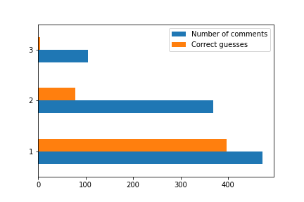
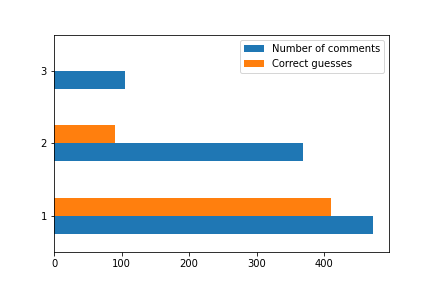
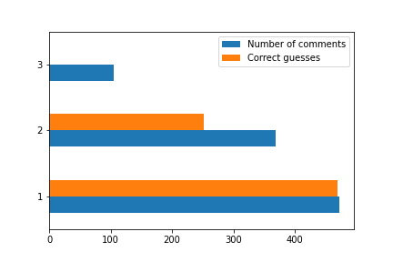

# Summary

---

### NB / Bag of words

| bins | graph | sentences |
|------|-------|-----------|
| 2    |  | [sentences.json](nb-bows/2-bins/sentences.json) |
| 3    |  | [sentences.json](nb-bows/3-bins/sentences.json) |
| 4    |  | [sentences.json](nb-bows/4-bins/sentences.json) |

### NB / Bag of bigrams

| bins | graph | sentences |
|------|-------|-----------|
| 2    |  | [sentences.json](nb-bigrams/2-bins/sentences.json) |
| 3    |  | [sentences.json](nb-bigrams/3-bins/sentences.json) |
| 4    |  | [sentences.json](nb-bigrams/4-bins/sentences.json) |

### NB / TF-IDF

| bins | graph | sentences |
|------|-------|-----------|
| 2    |  | [sentences.json](nb-tfidf/2-bins/sentences.json) |
| 3    |  | [sentences.json](nb-tfidf/3-bins/sentences.json) |
| 4    |  | [sentences.json](nb-tfidf/4-bins/sentences.json) |

### NB / Other

| bins | graph | sentences |
|------|-------|-----------|
| 2    |  | [sentences.json](nb-other/2-bins/sentences.json) |
| 3    |  | [sentences.json](nb-other/3-bins/sentences.json) |
| 4    |  | [sentences.json](nb-other/4-bins/sentences.json) |

---

### SVM / Bag of words

| bins | graph | sentences |
|------|-------|-----------|
| 2    |  | [sentences.json](svm-bows/2-bins/sentences.json) |
| 3    |  | [sentences.json](svm-bows/3-bins/sentences.json) |
| 4    |  | [sentences.json](svm-bows/4-bins/sentences.json) |

### SVM / Bag of bigrams

| bins | graph | sentences |
|------|-------|-----------|
| 2    |  | [sentences.json](svm-bigrams/2-bins/sentences.json) |
| 3    |  | [sentences.json](svm-bigrams/3-bins/sentences.json) |
| 4    |  | [sentences.json](svm-bigrams/4-bins/sentences.json) |

### SVM / TF-IDF

| bins | graph | sentences |
|------|-------|-----------|
| 2    |  | [sentences.json](svm-tfidf/2-bins/sentences.json) |
| 3    |  | [sentences.json](svm-tfidf/3-bins/sentences.json) |
| 4    |  | [sentences.json](svm-tfidf/4-bins/sentences.json) |

### SVM / Other

| bins | graph | sentences |
|------|-------|-----------|
| 2    |  | [sentences.json](svm-other/2-bins/sentences.json) |
| 3    |  | [sentences.json](svm-other/3-bins/sentences.json) |
| 4    |  | [sentences.json](svm-other/4-bins/sentences.json) |
